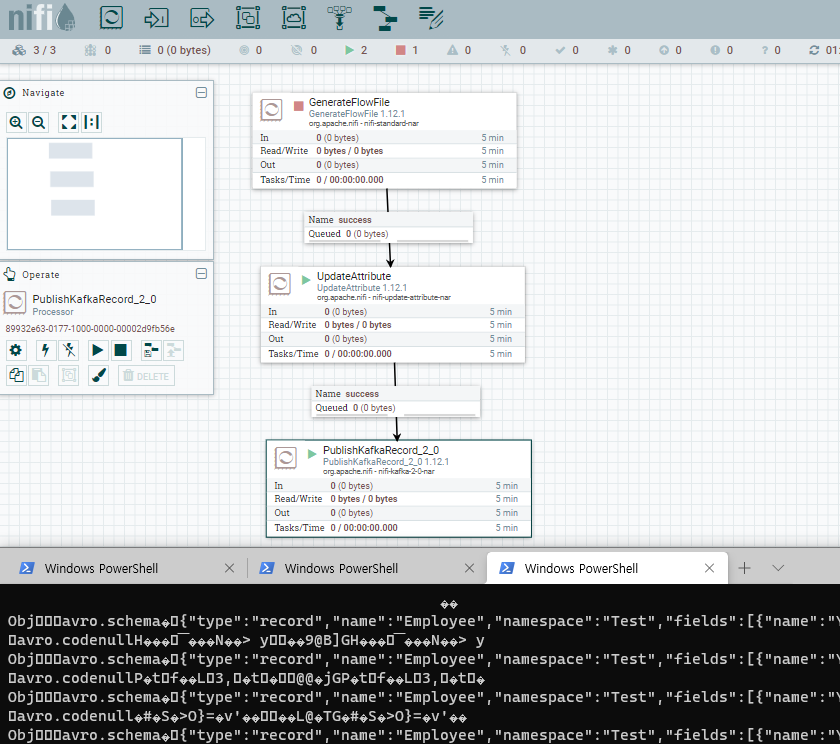

# zookeeper, kafka, nifi(with cluster)
## nifi cluster 확인
[nifi cluster] https://medium.com/@davide.gazze/an-example-of-nifi-cluster-using-docker-91921e955e52 

[nifi 예제]]: https://towardsdatascience.com/big-data-managing-the-flow-of-data-with-apache-nifi-and-apache-kafka-af674cd8f926

- cluster로 되어 있을경우, 아래 docker ps를 통해서 확인된 nifi port로 nifi 접근 가능
[web] http://localhost:55002/nifi

```
$ docker-compose -f docker-compose.yml up -d [zookeeper|kafka|nifi(single)]
$ docker-compose -f .\docker-compose.yml up --scale nifi=3 -d  
$ docker-compose ps
                    Name                              Command            State                     Ports
------------------------------------------------------------------------------------------------------------------------
elk_home_credit_default_risk_kafka_1       /etc/confluent/docker/run   Up      0.0.0.0:9092->9092/tcp
elk_home_credit_default_risk_nifi_1        ../scripts/start.sh         Up      10000/tcp, 8000/tcp,
                                                                                0.0.0.0:55002->8080/tcp, 8443/tcp
elk_home_credit_default_risk_nifi_2        ../scripts/start.sh         Up      10000/tcp, 8000/tcp,
                                                                                0.0.0.0:55001->8080/tcp, 8443/tcp
elk_home_credit_default_risk_nifi_3        ../scripts/start.sh         Up      10000/tcp, 8000/tcp,
                                                                                0.0.0.0:55000->8080/tcp, 8443/tcp
elk_home_credit_default_risk_zookeeper_1   /etc/confluent/docker/run   Up      2181/tcp, 2888/tcp, 3888/tcp
```


## kafka 확인
```
$ docker-compose exec kafka kafka-topics --zookeeper zookeeper:2181 --list
$ docker-compose exec kafka kafka-topics --create --topic test --partitions 1 --replication-factor 1 --if-not-exists --zookeeper zookeeper:2181
$ docker-compose exec kafka kafka-topics --describe --topic test --zookeeper zookeeper:2181
Topic: test     PartitionCount: 1       ReplicationFactor: 1    Configs:
        Topic: test     Partition: 0    Leader: 1       Replicas: 1     Isr: 1
$ docker-compose exec kafka kafka-console-consumer --bootstrap-server localhost:9092 --topic test --from-beginning --max-messages 30
$ docker-compose exec kafka kafka-console-producer --topic test --broker-list kafka:9092
ddd>dddasdf
>ddd
>
```

## 예제 결과


